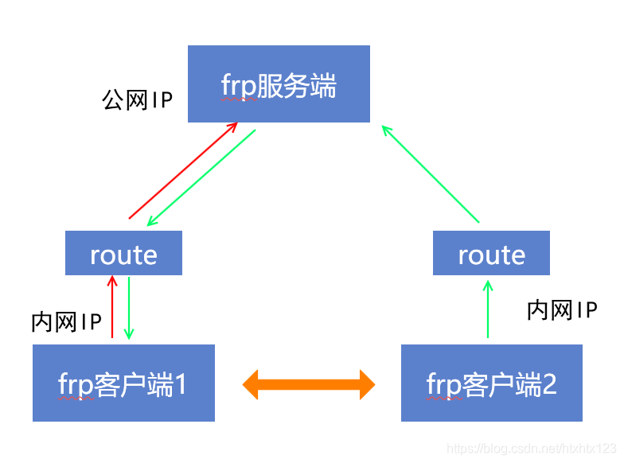

内网穿透frp
==========================

内网穿透是指在内网环境中，将内网服务暴露到公网上的技术。它可以让外部用户访问内网中的服务，而不需要进行复杂的网络配置。内网穿透通常用于远程访问、远程控制、远程调试等场景。
frp 是一个高性能的反向代理应用，专注于内网穿透。它可以将内网服务暴露到公网上，方便外部访问。frp 的使用非常简单，只需要在内网和公网各部署一个 frp 实例即可。

frp 的工作原理
----------------------------
frp 的工作原理是通过在内网和公网之间建立一个长连接，将内网服务的请求转发到公网。具体来说，frp 在内网和公网各部署一个 frp 实例，内网实例负责将内网服务的请求转发到公网实例，公网实例负责将外部请求转发到内网实例。这样就实现了内网穿透。
frp 的工作原理如下图所示：

    
服务器端部署
----------------------------

服务器必须有 **公网IP** 地址，且可以访问互联网。frp 的服务器端称为 frps，客户端称为 frpc。frps 负责接收来自 frpc 的请求，并将请求转发到内网服务。

1. 下载 frp
    在服务器上下载 frp 的最新版本，可以在 [frp 的 GitHub 页面](https://github.com/fatedier/frp/releases) 上找到最新版本的下载链接。下载完成后，解压缩文件。
    这里以 Linux 系统为例，使用以下命令下载和解压缩 frp：
.. code-block:: sh
   :caption: 下载 frp，Linux 系统
   :name: test333
   :emphasize-lines: 2
   :linenos:

   #下载
   wget https://github.com/fatedier/frp/releases/download/v0.62.1/frp_0.62.1_linux_amd64.tar.gz
   #解压
   tar -zxvf frp_0.62.1_linux_amd64.tar.gz
   #重命名解压后的文件夹为 frp
   mv frp_0.62.1_linux_amd64 frp

   
2. 配置 frp
    进入 frp 目录，找到 frps.toml 配置文件。
.. code-block:: toml
   :caption: frps.toml 配置文件
   :name: test444
   :linenos:

   #客户端连接端口，默认7000
   bind_port = 7000
   #web界面网址，默认为 127.0.0.1，如果需要公网访问，需要修改为 0.0.0.0。
   webServer.addr = "0.0.0.0"
   #web界面端口，默认7500
   webServer.port = 7500
   #web界面用户名密码，可选，默认为空
   webServer.user = "admin"
   webServer.password = "admin"
   
3. 启动 frp
    在 frp 目录下，使用以下命令启动 frps：
.. code-block:: sh
   :caption: 启动 frps
   :name: test555
   :linenos:

   #启动 frps
   ./frps -c ./frps.toml

4. 查看 frp 状态
    启动成功后，可以在浏览器中访问 `http://<公网IP>:7500` 来查看 frp 的状态。默认的用户名和密码都是 admin。
    如果需要修改用户名和密码，可以在 frps.toml 中修改 webServer.user 和 webServer.password。
    如果需要修改端口，可以在 frps.toml 中修改 webServer.port。
    如果需要修改地址，可以在 frps.toml 中修改 webServer.addr。
    如果需要修改其他配置，可以在 frps.toml 中修改其他配置。

5. 开机自启
    如果需要开机自启，可以将 frps 的启动命令添加到系统的开机启动项中。具体方法可以参考系统的相关文档。
    这里以 Linux 系统为例，使用以下命令添加开机启动项：
.. code-block:: sh
   :caption: frps.service
   :name: test666
   :linenos:

    #进入系统配置目录
    cd /etc/systemd/system/
    #创建 frps.service 文件
    sudo nano frps.service
    
    #添加以下内容
    [Unit]
    # 服务名称，可自定义
    Description = frp server
    After = network.target syslog.target
    Wants = network.target

    [Service]
    Type = simple
    User = root
    # 启动frps的命令，需修改为您的frps的安装路径
    ExecStart = /root/frp/frps -c /root/frp/frps.toml

    [Install]
    WantedBy = multi-user.target
    #保存并退出
    #启动服务
    sudo systemctl start frps
    #设置开机自启
    sudo systemctl enable frps
    #查看服务状态
    sudo systemctl status frps
    #停止服务
    sudo systemctl stop frps
    #重启服务
    sudo systemctl restart frps
    
客户端部署
----------------------------
客户端必须有 **内网IP** 地址，且可以访问互联网。frp 的客户端称为 frpc。frpc 负责将内网服务的请求转发到公网服务。
这里以树莓派4B为例，介绍如何在树莓派上部署 frp 客户端。

1. 下载 frp
    在客户端上下载 frp 的最新版本，可以在 [frp 的 GitHub 页面](https://github.com/fatedier/frp/releases) 上找到最新版本的下载链接。下载完成后，解压缩文件。
.. code-block:: sh
   :caption: 下载适用于树莓派4B的frp
   :name: test333
   :emphasize-lines: 2
   :linenos:

    #下载
    wget https://github.com/fatedier/frp/releases/download/v0.62.1/frp_0.62.1_linux_arm64.tar.gz
    #解压
    tar -zxvf frp_0.62.1_linux_arm64.tar.gz
    #重命名解压后的文件夹为 frp
    mv frp_0.62.1_linux_arm64 frp

2. 配置 frp
    进入 frp 目录，找到 frpc.toml 配置文件。
.. code-block:: toml    
   :caption: frpc.toml 配置文件
   :name: test444
   :linenos:

    #web界面网址，默认为127.0.0.1，如果需要公网访问，需要修改为0.0.0.0
    webServer.addr = "0.0.0.0"
    webServer.port = 7300
    webServer.user = "admin"
    webServer.password = "admin"

    #服务器地址
    #阿里云服务器公网IP
    #serverAddr = "8.8.8.8"
    #腾讯云服务器公网IP
    serverAddr = "8.8.8.8"
    #百度云服务器公网IP
    #serverAddr = "8.8.8.8"
    
    #服务器端口
    serverPort = 7000

    [[proxies]]
    name = "SSH服务"
    type = "tcp"
    localIP = "127.0.0.1"
    localPort = 22
    remotePort = 6022

    [[proxies]]
    name = "web服务"
    type = "tcp"
    localIP = "127.0.0.1"
    localPort = 8080
    remotePort = 10081

    # frpc.toml
    [[proxies]]
    name = "frp配置"
    type = "tcp"
    localPort = 7300
    remotePort = 7300

3. 启动 frp
    在 frp 目录下，使用以下命令启动 frpc：
.. code-block:: sh
   :caption: 启动 frpc
   :name: test555
   :linenos:

   #启动 frpc
   ./frpc -c ./frpc.toml
   